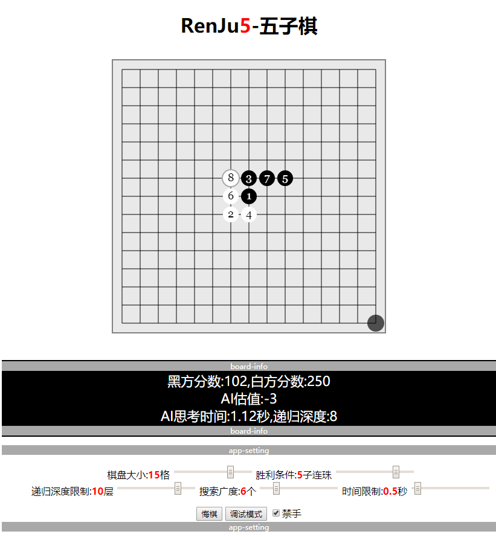
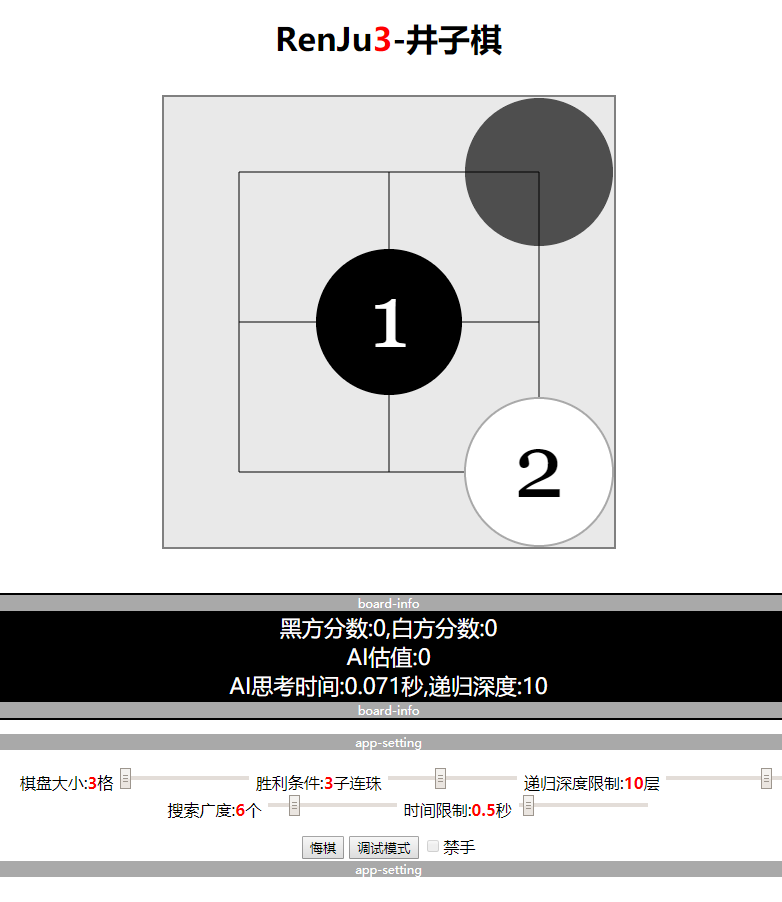

# RenJu_N-五(井)子棋

## [查看项目](https://brainburster.github.io/RenJu_N/public "五子棋项目")

## 说明

### 运行项目

- 直接用游览器打开*public*文件夹下的*index.html*即可
- 或者也可以在控制台输入`node index.js`启动一个静态文件服务器，然后在游览器地址栏输入`http://127.0.0.1:8080/`打开网页
- *src*目录下是源码文件，无法再游览器上运行，*public*目录下的是通过**webpack**打包之后生成的静态网页文件，能够在游览器上运行

### todolist

- [x] 可改变棋盘大小
- [x] 可设获胜所需的棋子数
- [x] 悔棋
- [x] 棋盘调试
- [x] 贪心算法
- [x] 博弈树
- [x] alpha-beta减枝
- [x] 启发式(先验)减枝
- [x] 迭代深化
- [ ] 置换表
- [ ] 开局库
- [x] 禁手
- [x] 网页多线程
- [x] AI设置界面
- [x] 设置时限
- [ ] 其他功能
